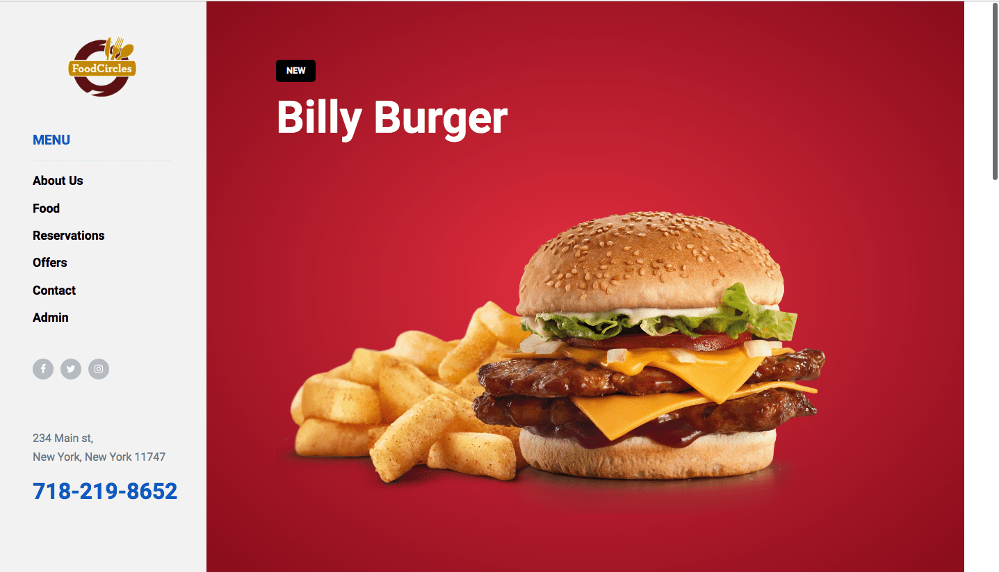

## Fullstack Restaurant

This is a fullstack desktop restaraunt application that I put together, via Laravel/php. I handled the database using mySQL. I also incorporated SCSS to assist with the styling, and bootstrap to further keep things in line. This application is complete with an administrative section, to view reservations, update site information, and even add new items to the food menu. This application could be adjusted to the needs of a potential client, who may run a small business, and would like to keep track of revenue and operations via the admin dashboard. 

Finally, different user accounts can be created, that grants different forms of access. You can create accounts straight into the database for more control, or a potential new employee could sign up for a regular user account.

## To Run

To run this application, first clone it to a local repository. Install all dependencies using "npm install",
and then make sure you have composer installed on your machine. If you would like to interact with the database, 
ensure you have MAMP installed, and configure a local server. Finally in the project root, go to the home directory,
and in your terminal, run "php artisan serve".

## About Laravel

Laravel is accessible, powerful, and provides tools required for large, robust applications.

## License

The Laravel framework is open-sourced software licensed under the [MIT license](https://opensource.org/licenses/MIT).
